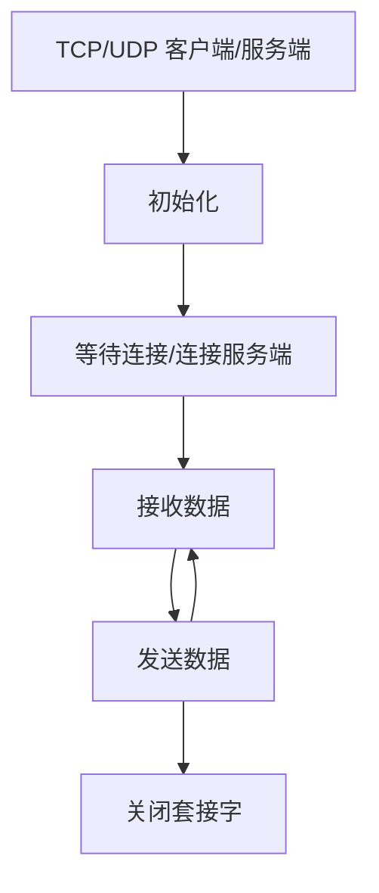
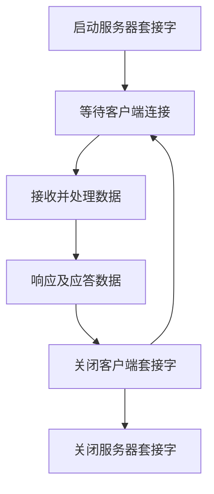
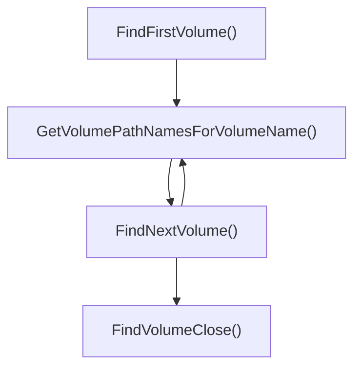
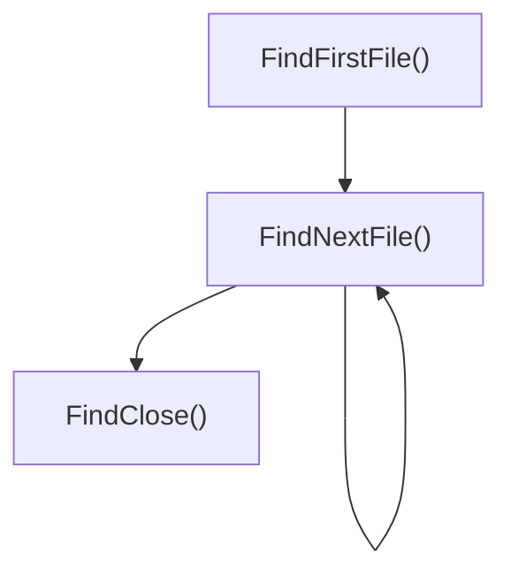
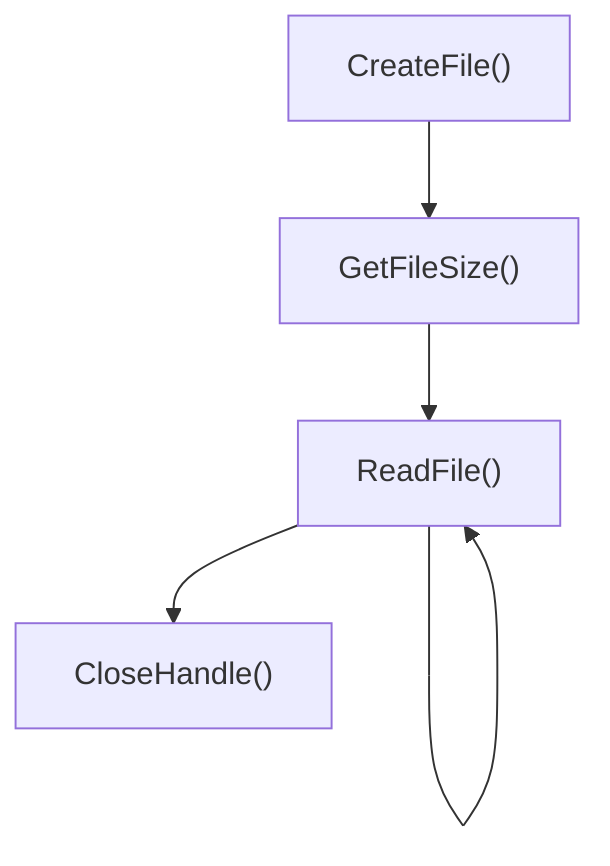
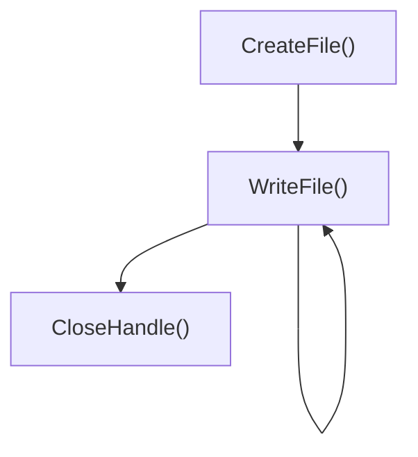

# RemoteCtrl
远程桌面控制系统，Windows下服务器，客户端使用MFC

## git仓库创建与本地搭建

本节详解，如何在GitHub上创建仓库以及在本地克隆仓库进行项目提交

在开始之前需要大家完成几项前提的任务

	1. 注册GitHub账号
	1. 下载并安装Git，https://git-scm.com/
	1. 下载并安装乌龟Git，https://download.tortoisegit.org/tgit/

### 创建仓库

在GitHub上点击New，进行仓库创建


Repository name：输入你的仓库名

Desciption：对你仓库里要存东西的一个描述

Public/Private：仓库公开还是私有

Add  a README file：勾选上则会生产一个README.md文件并会为你创建一个默认的main分支，可以在这里写项目的说明，建议勾选上

Add .gitignore：进行仓库模板的选择，里面什么项目的模板都有，建议选择一下

Choose a license：可以选择一个许可证信息

上面选择好后，点击Create repository，稍等片刻就会创建好一个新的仓库了

### 本地克隆仓库

在本地克隆仓库之前，建议设置一下git代理，如果没有的话推送可能由于网络的原因造成失败

配置socks5代理

```
//命令行输入
git config --global http.proxy socks5 127.0.0.1:7890
git config --global https.proxy socks5 127.0.0.1:7890
```

配置http代理

```
//命令行输入
git config --global http.proxy 127.0.0.1:7890
git config --global https.proxy 127.0.0.1:7890
```

**前提是你的电脑上有代理，上面的代码才有效，记得后面的7890要换成你本机上代理的端口**

#### 获取仓库地址

在GitHub上选择你新建的仓库，点击Code把https对应的地址复制一下


#### 本地克隆仓库

选择一个目录，鼠标右键点击"Git 克隆"


如果你正确复制了仓库的地址，则会自动帮你填充，点击确定即可


稍等片刻，便会创建好克隆的仓库文件夹，文件夹里面也会有GitHub仓库上的文件

### 进行代码提交推送

上面步骤完成，就可以在这个克隆的文件夹里面创建你的项目了

#### 提交及推送

进入克隆的文件夹下，鼠标右键点击“Git 提交”


在提交的时候，需要写日志不写没有办法提交，写完后点击提交并推送就可以了


刷新一下GitHub就可以看到你提交的内容

## 网络数据包封装

数据包

​	固定字节：10字节

​	总长度不得超过**MTU**

包括

​	包头(2byte)：固定首部FEFF

​	包序号(2byte)：从1开始

​	包长度(2byte)：从"数据校验和"到"数据包尾部"

​	数据校验和(4byte)：只计算"数据"部分总和

​	数据：要发送的真实数据

## 网络编程模块

### 设计预期效果

用户调用一个接口，就可以实现TCP或UDP客户端或服务器的创建

### 模板化思路（已基本实现）

利用模板将两个模块（UDP/TCP）联系到一起，通过继承关系实现类的初始化

### 每个模块实现思路

将每部操作进行规范化，使用分支语句实现同一函数调用不同的套接字函数，使得同协议服务器和客户端的套接字创建，这一套代码就可以满足需求

运用单例设计模式，将类的构造析构函数私有化，防止别人绕开我们的逻辑去创建套接字

删除了类的复制构造和等号重载，防止套接字被复制多份，导致关闭套接字时产生问题

#### 规范化

通过分析TCP和UDP网络编程的相关步骤，将其进行规范化

TCP客户端/服务器网络编程：


UDP客户端/服务器网络编程：


规范后流程：



相关代码在.\RemoteCtrl\RemoteCtrl\CLNetworkSocket.cpp和.\RemoteCtrl\RemoteCtrl\CLNetworkSocket.h文件中

## 服务器

本服务器与客户端建立的为短时链接即当客户端连接上来并请求执行特定指令时，当指令执行完服务器会主动与客户端断开连接

### 服务器命令处理流程图



### 文件查看功能

#### 获取卷

通过[FindFirstVolume()](https://learn.microsoft.com/zh-cn/windows/win32/api/winbase/nf-winbase-findfirstvolumea?devlangs=cpp&f1url=%3FappId%3DDev16IDEF1%26l%3DZH-CN%26k%3Dk(WINBASE%252FFindFirstVolumeA)%3Bk(FindFirstVolumeA)%3Bk(DevLang-C%252B%252B)%3Bk(TargetOS-Windows)%26rd%3Dtrue)、[GetVolumePathNamesForVolumeName()](https://learn.microsoft.com/zh-cn/windows/win32/api/winbase/nf-winbase-getvolumepathnamesforvolumenamea?devlangs=cpp&f1url=%3FappId%3DDev16IDEF1%26l%3DZH-CN%26k%3Dk(WINBASE%252FGetVolumePathNamesForVolumeNameA)%3Bk(GetVolumePathNamesForVolumeNameA)%3Bk(DevLang-C%252B%252B)%3Bk(TargetOS-Windows)%26rd%3Dtrue)、[FindNextVolume()](https://learn.microsoft.com/zh-cn/windows/win32/api/winbase/nf-winbase-findnextvolumea?devlangs=cpp&f1url=%3FappId%3DDev16IDEF1%26l%3DZH-CN%26k%3Dk(WINBASE%252FFindNextVolumeA)%3Bk(FindNextVolumeA)%3Bk(DevLang-C%252B%252B)%3Bk(TargetOS-Windows)%26rd%3Dtrue)、[FindVolumeClose()](https://learn.microsoft.com/zh-cn/windows/win32/api/fileapi/nf-fileapi-findvolumeclose?devlangs=cpp&f1url=%3FappId%3DDev16IDEF1%26l%3DZH-CN%26k%3Dk(FILEAPI%252FFindVolumeClose)%3Bk(FindVolumeClose)%3Bk(DevLang-C%252B%252B)%3Bk(TargetOS-Windows)%26rd%3Dtrue)等函数实现

流程图：



#### 获取文件

通过[FindFirstFile()](https://learn.microsoft.com/zh-cn/windows/win32/api/fileapi/nf-fileapi-findfirstfilea?devlangs=cpp&f1url=%3FappId%3DDev16IDEF1%26l%3DZH-CN%26k%3Dk(FILEAPI%252FFindFirstFileA)%3Bk(FindFirstFileA)%3Bk(DevLang-C%252B%252B)%3Bk(TargetOS-Windows)%26rd%3Dtrue)、[FindNextFile()](https://learn.microsoft.com/zh-cn/windows/win32/api/fileapi/nf-fileapi-findnextfilea?devlangs=cpp&f1url=%3FappId%3DDev16IDEF1%26l%3DZH-CN%26k%3Dk(FILEAPI%252FFindNextFileA)%3Bk(FindNextFileA)%3Bk(DevLang-C%252B%252B)%3Bk(TargetOS-Windows)%26rd%3Dtrue)、[FindClose()](https://learn.microsoft.com/zh-cn/windows/win32/api/fileapi/nf-fileapi-findclose?devlangs=cpp&f1url=%3FappId%3DDev16IDEF1%26l%3DZH-CN%26k%3Dk(FILEAPI%252FFindClose)%3Bk(FindClose)%3Bk(DevLang-C%252B%252B)%3Bk(TargetOS-Windows)%26rd%3Dtrue)等函数实现

流程图：



### 文件下载/上传功能

#### 下载

对于控制端来说，下载就是把被控端上存在的文件下载到本地

文件读取流程图：



#### 上传

对于控制端来说，上传就是将本地上存在的文件上传到被控端电脑上

文件写入流程图：



### 系统锁定/解锁功能

#### 锁定

通过开线程的方式进行系统上锁，最终状态使鼠标键盘不能使用，在屏幕上显示系统已锁定字样

#### 解锁

解锁则是模拟键盘向锁定线程发送消息，线程响应消息达到解锁的目的

## 遇到的错误及解决方法

### 添加资源（对话框等）遇到的问题

问题描述：在资源添加完成以后，编译的时候报错：error C2504: “CDialogEx”: 未定义基类


问题分析：不是咱们创建的类，出现这种错误，大概的原因就是由于缺少头文件导致的

问题解决：在pch.h文件中，添加<afxcontrolbars.h>头文件，问题就解决了
